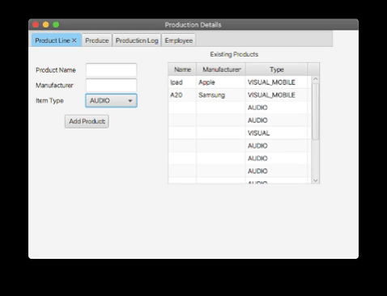
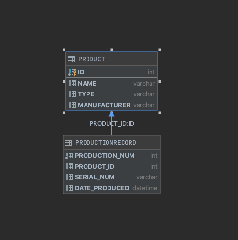
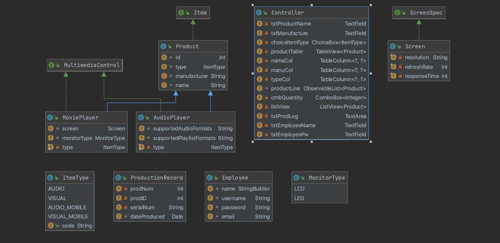

# Production Project
  
This program is for a media player production facility, which will help them to keep track of what products are produced. When a new product is added, instead of physically documenting it, the workers can add it to this program and the new product will be added to a Products table. At any time, a list of existing products are displayed in the product line tab. Additionally, when products that are on the system are produced, the workers can enter it into the system to be recorded and added to a Production Records table. Workers can even select the quantity that is being produced so they do not have to repeatedly add a product to the table. The software also allows management to be able to know which employee logged which products, so everytime an employee adds a product, they have to enter their name and password.    

This project was a semester long project for a Object Oriented Programming course. Using guidelines given by the professor of the course, I did this project. This assignment was a great way to learn object oriented programming, especially as this was my first experience with object oriented programming.  

# Demonstration

 

# Documentation

[Javadocs Link](https://shanazramsaroop.github.io/ProductionOOP/package-summary.html)

# Diagrams

  
Database Diagram    

  
Class Diagram   

# Built with

* IntelliJ was the IDE used

# Author

Shanaz Ramsaroop

